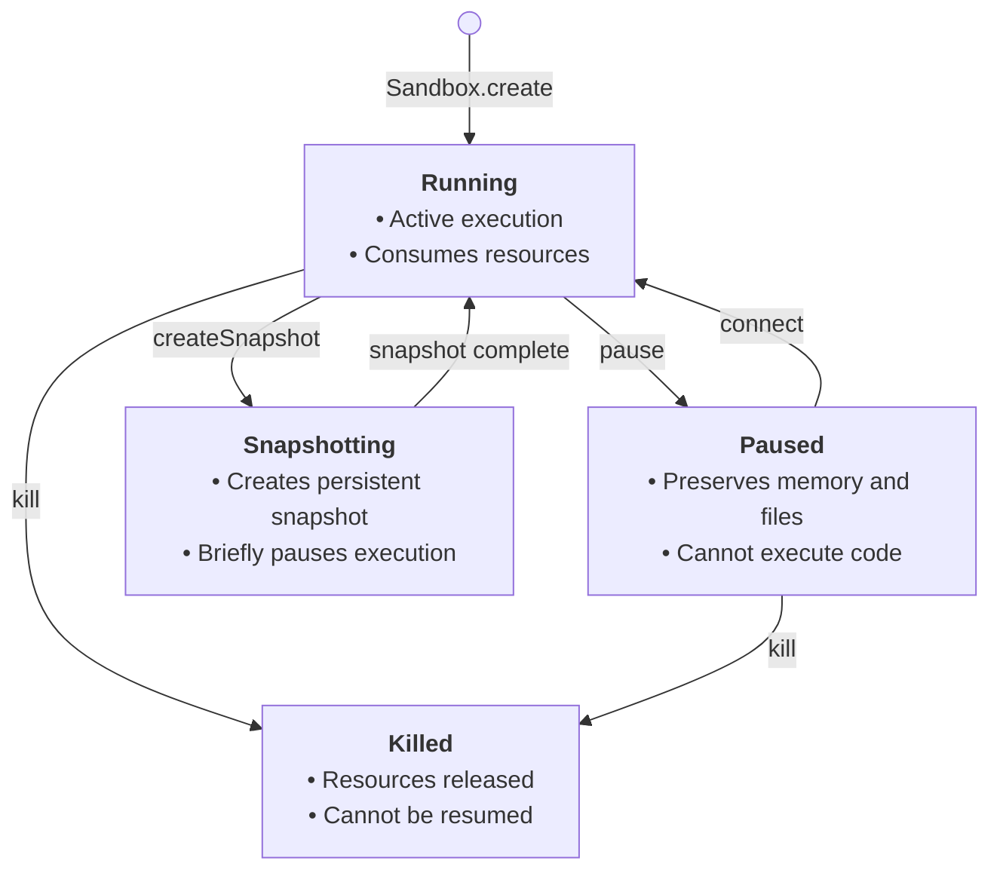

The sandbox persistence allows you to pause your sandbox and resume it later from the same state it was in when you paused it.

This includes not only state of the sandbox's filesystem but also the sandbox's memory. This means all running processes, loaded variables, data, etc.

## Sandbox state transitions

Understanding how sandboxes transition between different states is crucial for managing their lifecycle effectively. Here's a diagram showing the possible state transitions:



### State descriptions

- **Running**: The sandbox is actively running and can execute code. This is the initial state after creation.
- **Paused**: The sandbox execution is suspended but its state is preserved.
- **Snapshotting**: The sandbox is briefly paused while a persistent snapshot is being created. It automatically returns to Running. See [Snapshots](/docs/sandbox/snapshots).
- **Killed**: The sandbox is terminated and all resources are released. This is a terminal state.

### Changing sandbox's state

<CodeGroup>
```js JavaScript & TypeScript
import { Sandbox } from '@e2b/code-interpreter'

const sandbox = await Sandbox.create() // Starts in Running state

// Pause the sandbox
await sandbox.pause() // Running → Paused

// Resume the sandbox
await sandbox.connect() // Running/Paused → Running

// Kill the sandbox (from any state)
await sandbox.kill() // Running/Paused → Killed
```

```python Python
from e2b_code_interpreter import Sandbox

sandbox = Sandbox.create()  # Starts in Running state

# Pause the sandbox
sandbox.pause()  # Running → Paused

# Resume the sandbox
sandbox.connect()  # Running/Paused → Running

# Kill the sandbox (from any state)
sandbox.kill()  # Running/Paused → Killed
```
</CodeGroup>

## Pausing sandbox
When you pause a sandbox, both the sandbox's filesystem and memory state will be saved. This includes all the files in the sandbox's filesystem and all the running processes, loaded variables, data, etc.

<CodeGroup>
```js JavaScript & TypeScript highlight={8-9}
import { Sandbox } from '@e2b/code-interpreter'

const sbx = await Sandbox.create()
console.log('Sandbox created', sbx.sandboxId)

// Pause the sandbox
// You can save the sandbox ID in your database to resume the sandbox later
await sbx.pause()
console.log('Sandbox paused', sbx.sandboxId)
```
```python Python highlight={8-9}
from e2b_code_interpreter import Sandbox

sbx = Sandbox.create()
print('Sandbox created', sbx.sandbox_id)

# Pause the sandbox
# You can save the sandbox ID in your database to resume the sandbox later
sbx.pause()
print('Sandbox paused', sbx.sandbox_id) 
```
</CodeGroup>


## Resuming sandbox
When you resume a sandbox, it will be in the same state it was in when you paused it.
This means that all the files in the sandbox's filesystem will be restored and all the running processes, loaded variables, data, etc. will be restored.

<CodeGroup>
```js JavaScript & TypeScript highlight={12-13}
import { Sandbox } from '@e2b/code-interpreter'

const sbx = await Sandbox.create()
console.log('Sandbox created', sbx.sandboxId)

// Pause the sandbox
// You can save the sandbox ID in your database to resume the sandbox later
await sbx.pause()
console.log('Sandbox paused', sbx.sandboxId)

// Connect to the sandbox (it will automatically resume the sandbox, if paused)
const sameSbx = await sbx.connect()
console.log('Connected to the sandbox', sameSbx.sandboxId)
```
```python Python highlight={12-13}
from e2b_code_interpreter import Sandbox

sbx = Sandbox.create()
print('Sandbox created', sbx.sandbox_id)

# Pause the sandbox
# You can save the sandbox ID in your database to resume the sandbox later
sbx.pause()
print('Sandbox paused', sbx.sandbox_id)

# Connect to the sandbox (it will automatically resume the sandbox, if paused)
same_sbx = sbx.connect()
print('Connected to the sandbox', same_sbx.sandbox_id)
```
</CodeGroup>

## Listing paused sandboxes
You can list all paused sandboxes by calling the `Sandbox.list` method and supplying the `state` query parameter.
More information about using the method can be found in [List Sandboxes](/docs/sandbox/list).

<CodeGroup>
```js JavaScript & TypeScript highlight={4,7}
import { Sandbox, SandboxInfo } from '@e2b/code-interpreter'

// List all paused sandboxes
const paginator = Sandbox.list({ query: { state: ['paused'] } })

// Get the first page of paused sandboxes
const sandboxes = await paginator.nextItems()

// Get all paused sandboxes
while (paginator.hasNext) {
  const items = await paginator.nextItems()
  sandboxes.push(...items)
}
```
```python Python highlight={4,7}
# List all paused sandboxes
from e2b_code_interpreter import Sandbox, SandboxQuery, SandboxState

paginator = Sandbox.list(SandboxQuery(state=[SandboxState.PAUSED]))

# Get the first page of paused sandboxes
sandboxes = paginator.next_items()

# Get all paused sandboxes
while paginator.has_next:
  items = paginator.next_items()
  sandboxes.extend(items)
```
</CodeGroup>

## Removing paused sandboxes

You can remove paused sandboxes by calling the `kill` method on the Sandbox instance.

<CodeGroup>
```js JavaScript & TypeScript highlight={11,14}
import { Sandbox } from '@e2b/code-interpreter'

const sbx = await Sandbox.create()
console.log('Sandbox created', sbx.sandboxId)

// Pause the sandbox
// You can save the sandbox ID in your database to resume the sandbox later
await sbx.pause()

// Remove the sandbox
await sbx.kill()

// Remove sandbox by id
await Sandbox.kill(sbx.sandboxId)
```
```python Python highlight={9,12}
from e2b_code_interpreter import Sandbox

sbx = Sandbox.create()

# Pause the sandbox
sbx.pause()

# Remove the sandbox
sbx.kill()

# Remove sandbox by id
Sandbox.kill(sbx.sandbox_id)
```
</CodeGroup>

## Sandbox's timeout
When you connect to a sandbox, the inactivity timeout resets. The default is 5 minutes, but you can pass a custom timeout to the `Sandbox.connect()` method:

<CodeGroup>
```js JavaScript & TypeScript
import { Sandbox } from '@e2b/code-interpreter'

const sbx = await Sandbox.connect(sandboxId, { timeoutMs: 60 * 1000 }) // 60 seconds
```
```python Python
from e2b_code_interpreter import Sandbox

sbx = Sandbox.connect(sandbox_id, timeout=60) # 60 seconds
```
</CodeGroup>


### Auto-pause

Auto-pause is configured in the sandbox lifecycle on create. Set `onTimeout`/`on_timeout` to `pause`.

<CodeGroup>
```js JavaScript & TypeScript
import { Sandbox } from 'e2b'

const sandbox = await Sandbox.create({
  timeoutMs: 10 * 60 * 1000, // Optional: change default timeout (10 minutes)
  lifecycle: {
    onTimeout: 'pause',
    autoResume: false, // Optional (default is false)
  },
})
```
```python Python
from e2b import Sandbox

sandbox = Sandbox.create(
    timeout=10 * 60,  # Optional: change default timeout (10 minutes)
    lifecycle={
        "on_timeout": "pause", # Auto-pause after the sandbox times out
        "auto_resume": False,  # Optional (default is False)
    },
)
```
</CodeGroup>

Auto-pause is persistent, meaning if your sandbox resumes and later times out again, it will pause again.

If you call `.kill()`, the sandbox is permanently deleted and cannot be resumed.

For auto-resume behavior, see [AutoResume](/docs/sandbox/auto-resume).

## Network
If you have a service (for example a server) running inside your sandbox and you pause the sandbox, the service won't be accessible from the outside and all the clients will be disconnected.
If you resume the sandbox, the service will be accessible again but you need to connect clients again.


## Limitations

### Pause and resume performance
- Pausing a sandbox takes approximately **4 seconds per 1 GiB of RAM**
- Resuming a sandbox takes approximately **1 second**

### Paused sandbox retention
- Paused sandboxes are kept **indefinitely** — there is no automatic deletion or time-to-live limit
- You can resume a paused sandbox at any time

### Continuous runtime limits
- A sandbox can remain running (without being paused) for:
  - **24 hours** on the **Pro tier**
  - **1 hour** on the **Base tier**
- After a sandbox is paused and resumed, the continuous runtime limit is **reset**
