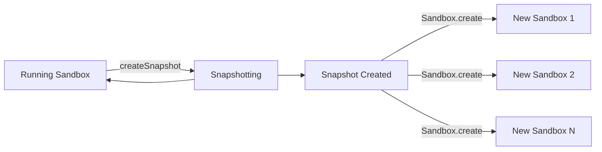

Snapshots let you create a persistent point-in-time capture of a running sandbox, including both its filesystem and memory state.
You can then use a snapshot to spawn new sandboxes that start from the exact same state.

The original sandbox continues running after the snapshot is created, and a single snapshot can be used to create many new sandboxes.

## Snapshots vs. Pause/Resume

| | Pause/Resume | Snapshots |
|---|---|---|
| Effect on original sandbox | Pauses (stops) the sandbox | Sandbox briefly pauses, then continues running |
| Relationship | One-to-one — resume restores the same sandbox | One-to-many — snapshot can spawn many new sandboxes |
| Use case | Suspend and resume a single sandbox | Create a reusable checkpoint |

For pause/resume functionality, see [Persistence](/docs/sandbox/persistence).

## Snapshot flow



The sandbox is briefly paused during the snapshot process but automatically returns to running state. The sandbox ID stays the same after the snapshot completes.

<Warning>
During the snapshot, the sandbox is temporarily paused and resumed. This causes all active connections (e.g. WebSocket, PTY, command streams) to be dropped. Make sure your client handles reconnection properly.
</Warning>

## Create a snapshot

You can create a snapshot from a running sandbox instance.

<CodeGroup>
```js JavaScript & TypeScript
import { Sandbox } from 'e2b'

const sandbox = await Sandbox.create()

// Create a snapshot from a running sandbox
const snapshot = await sandbox.createSnapshot()
console.log('Snapshot ID:', snapshot.snapshotId)
```
```python Python
from e2b import Sandbox

sandbox = Sandbox.create()

# Create a snapshot from a running sandbox
snapshot = sandbox.create_snapshot()
print('Snapshot ID:', snapshot.snapshot_id)
```
</CodeGroup>

You can also create a snapshot by sandbox ID using the static method.

<CodeGroup>
```js JavaScript & TypeScript
import { Sandbox } from 'e2b'

// Create a snapshot by sandbox ID
const snapshot = await Sandbox.createSnapshot(sandboxId)
console.log('Snapshot ID:', snapshot.snapshotId)
```
```python Python
from e2b import Sandbox

# Create a snapshot by sandbox ID
snapshot = Sandbox.create_snapshot(sandbox_id)
print('Snapshot ID:', snapshot.snapshot_id)
```
</CodeGroup>

## Create a sandbox from a snapshot

The snapshot ID can be used directly with `Sandbox.create()` to spawn a new sandbox from the snapshot. The new sandbox starts with the exact filesystem and memory state captured in the snapshot.

<CodeGroup>
```js JavaScript & TypeScript highlight={5}
import { Sandbox } from 'e2b'

const snapshot = await sandbox.createSnapshot()

// Create a new sandbox from the snapshot
const newSandbox = await Sandbox.create(snapshot.snapshotId)
```
```python Python highlight={5}
from e2b import Sandbox

snapshot = sandbox.create_snapshot()

# Create a new sandbox from the snapshot
new_sandbox = Sandbox.create(snapshot.snapshot_id)
```
</CodeGroup>

## List snapshots

You can list all snapshots. The method returns a paginator for iterating through results.

<CodeGroup>
```js JavaScript & TypeScript
import { Sandbox } from 'e2b'

const paginator = Sandbox.listSnapshots()

const snapshots = []
while (paginator.hasNext) {
  const items = await paginator.nextItems()
  snapshots.push(...items)
}
```
```python Python
from e2b import Sandbox

paginator = Sandbox.list_snapshots()

snapshots = []
while paginator.has_next:
    items = paginator.next_items()
    snapshots.extend(items)
```
</CodeGroup>

### Filter by sandbox

You can filter snapshots created from a specific sandbox.

<CodeGroup>
```js JavaScript & TypeScript
import { Sandbox } from 'e2b'

const paginator = Sandbox.listSnapshots({ sandboxId: 'your-sandbox-id' })
const snapshots = await paginator.nextItems()
```
```python Python
from e2b import Sandbox

paginator = Sandbox.list_snapshots(sandbox_id="your-sandbox-id")
snapshots = paginator.next_items()
```
</CodeGroup>

## Delete a snapshot

<CodeGroup>
```js JavaScript & TypeScript
import { Sandbox } from 'e2b'

// Returns true if deleted, false if the snapshot was not found
const deleted = await Sandbox.deleteSnapshot(snapshot.snapshotId)
```
```python Python
from e2b import Sandbox

Sandbox.delete_snapshot(snapshot.snapshot_id)
```
</CodeGroup>

## Snapshots vs. Templates

Both snapshots and [templates](/docs/template/quickstart) create reusable starting points for sandboxes, but they solve different problems.

| | Templates | Snapshots |
|---|---|---|
| Defined by | Declarative code (Template builder) | Capturing a running sandbox |
| Reproducibility | Same definition produces the same sandbox every time | Captures whatever state exists at that moment |
| Best for | Repeatable base environments | Checkpointing, rollback, forking runtime state |

Use templates when every sandbox should start from an identical, known state — pre-installed tools, fixed configurations, consistent environments.
Use snapshots when you need to capture or fork live runtime state that depends on what happened during execution.

## Use cases

- **Checkpointing agent work** — an AI agent has loaded data and produced partial results in memory. Snapshot it so you can resume or fork from that point later.
- **Rollback points** — snapshot before a risky or expensive operation (running untrusted code, applying a migration, refactoring a web app). If it fails, rollback - spawn a fresh sandbox from the snapshot before the operation happened.
- **Forking workflows** — spawn multiple sandboxes from the same snapshot to explore different approaches in parallel.
- **Cached sandboxes** — avoid repeating expensive setup by snapshotting a sandbox that has already loaded a large dataset or started a long-running process.
- **Sharing state** — one user or agent configures an environment interactively, snapshots it, and others start from that exact state.
